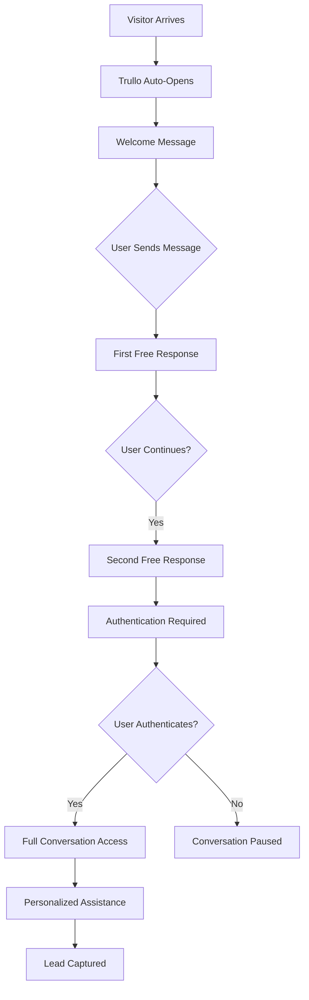

# Create the Trullo documentation
$trulloDocContent = @'
# 🤖 Trullo AI Chatbot - Documentation

## Table of Contents
1. [Overview](#overview)
2. [Architecture](#architecture)
3. [Features](#features)
4. [Authentication Flow](#authentication-flow)
5. [Configuration](#configuration)
6. [Components Structure](#components-structure)
7. [API Integration](#api-integration)
8. [Customization Guide](#customization-guide)
9. [Deployment](#deployment)
10. [Troubleshooting](#troubleshooting)
11. [Performance & Cost Management](#performance--cost-management)

---

## Overview

Trullo is an intelligent, multi-language AI chatbot designed specifically for InvestInPuglia.eu. It serves as a sophisticated virtual investment advisor, helping international investors discover EU grant opportunities and property investments in Puglia, Italy.

### Key Objectives
- **Lead Generation**: Convert visitors into qualified leads through elegant conversation
- **Cost Protection**: Require authentication after 2 messages to manage OpenAI API costs
- **Professional Sales**: Maintain consultative approach without being pushy
- **Multi-language Support**: Communicate in 7 languages (EN, IT, ES, FR, DE, AR, ZH)
- **24/7 Availability**: Provide instant assistance to global investors

### Core Value Proposition
- EU grants information (up to €2.25M available)
- Property investment guidance
- Personalized consultation booking
- Expert team connection

---

## Architecture

### Technology Stack
```
Frontend:
├── React 18 with TypeScript
├── Tailwind CSS for styling
├── Framer Motion for animations
└── Next.js 14 App Router

Backend Integration:
├── OpenAI API (GPT model)
├── Supabase (Authentication & Database)
├── EmailJS (Email notifications)
└── Next.js API Routes
```

### Component Structure
```
components/trullo/
├── TrulloChatbot.tsx          # Main component with auth UI
├── ChatMessages.tsx           # Message display component
├── ChatInput.tsx              # User input component
├── ContactForm.tsx            # Lead capture form
├── constants/
│   ├── translations.ts        # UI translations (7 languages)
│   ├── prompts.ts            # AI system prompts
│   └── authMessages.ts       # Authentication messages
├── hooks/
│   └── useChat.ts            # Chat logic & auth state
├── types/
│   └── index.ts              # TypeScript definitions
└── utils/
    ├── api.ts                # API communication
    └── authentication.ts     # Auth utilities
```

---

## Features

### 1. **Smart Authentication System**
- Free welcome message for all visitors
- 2 free messages to engage users
- Google OAuth integration for continued conversation
- Email verification tracking
- Session management

### 2. **Multi-language Support**
- 7 languages: English, Italian, Spanish, French, German, Arabic, Chinese
- RTL support for Arabic
- Language-specific sales prompts
- Instant language switching

### 3. **Elegant UI/UX**
- Responsive design (mobile & desktop)
- Smooth animations
- Swipe-to-close on mobile
- Auto-open after 3 seconds (first visit)
- Persistent user preferences

### 4. **Lead Management**
- Conversation tracking in Supabase
- Email capture and verification
- Automated email notifications
- Contact form integration
- Session analytics

### 5. **Sales Intelligence**
- Professional, consultative tone
- Context-aware responses
- Investment opportunity suggestions
- Natural consultation booking flow
- Trust-building approach

---

## Authentication Flow

### User Journey


### Authentication States
```typescript
interface AuthState {
  isAuthenticated: boolean;      // User logged in
  isGiuseppe: boolean;           // Special admin access
  awaitingPassword: boolean;     // Giuseppe password prompt
  userEmail?: string;            // Authenticated user email
  userId?: string;               // Supabase user ID
  messageCount: number;          // Messages sent (for free limit)
  requiresAuth: boolean;         // Auth overlay shown
}
```

---

## Configuration

### Environment Variables
```bash
# Required in .env.local
NEXT_PUBLIC_SUPABASE_URL=your_supabase_url
NEXT_PUBLIC_SUPABASE_ANON_KEY=your_supabase_anon_key
OPENAI_API_KEY=your_openai_api_key
NEXT_PUBLIC_EMAILJS_SERVICE_ID=your_emailjs_service_id
NEXT_PUBLIC_EMAILJS_TEMPLATE_ID=your_emailjs_template_id
NEXT_PUBLIC_EMAILJS_PUBLIC_KEY=your_emailjs_public_key
```

### Customization Options

#### 1. **Message Limits**
```typescript
// In components/trullo/hooks/useChat.ts
// Change free message limit (currently 2)
if (!authState.isAuthenticated && authState.messageCount >= 2) {
  // Require authentication
}
```

#### 2. **Auto-Open Delay**
```typescript
// In components/trullo/TrulloChatbot.tsx
// Change from 3 seconds to desired delay
setTimeout(() => {
  setIsOpen(true);
}, 3000); // milliseconds
```

#### 3. **Giuseppe Secret Password**
```typescript
// In components/trullo/utils/authentication.ts
const GIUSEPPE_SECRET = '250milionieuro'; // Change this!
```

#### 4. **Chatbot Position**
```typescript
// Desktop position (center-bottom)
'bottom-4 left-1/2 transform -translate-x-1/2 w-96 h-[500px]'

// Mobile position (full-width bottom)
'inset-x-4 bottom-0 h-[70vh] rounded-b-none'
```

---

## Components Structure

### TrulloChatbot.tsx
Main component that handles:
- UI rendering and responsive design
- Authentication overlay display
- Language switching
- Mobile swipe gestures
- Google OAuth integration

### useChat Hook
Core logic management:
- Message state management
- Authentication state tracking
- API communication
- Session management
- Message count tracking

### ChatMessages.tsx
Message display with:
- Typing indicators
- Message timestamps
- Role-based styling
- Auto-scroll to latest

### ChatInput.tsx
User input handling:
- Multi-line support
- Send on Enter
- Disabled state during auth
- "Leave a message" option

### ContactForm.tsx
Lead capture form:
- Name, email, phone fields
- Supabase integration
- Email notifications
- Success handling

---

## API Integration

### OpenAI Integration
```typescript
// API Route: app/api/chat/route.ts
const response = await openai.chat.completions.create({
  model: "gpt-3.5-turbo",
  messages: [
    { role: "system", content: systemPrompt },
    ...conversationHistory
  ],
  temperature: 0.7,
  max_tokens: 500
});
```

### Supabase Integration
```typescript
// User authentication
const { data: { user } } = await supabase.auth.getUser();

// Conversation logging
const { data, error } = await supabase
  .from('trullo_conversations')
  .insert({
    session_id: sessionId,
    language: language,
    started_at: new Date().toISOString()
  });
```

### Email Integration
```typescript
// Via EmailJS
await emailjs.send(
  serviceId,
  templateId,
  {
    name: formData.name,
    email: formData.email,
    message: formData.message,
    conversation_history: conversationHistory
  }
);
```

---

## Customization Guide

### Adding a New Language

1. **Update Language Type**
```typescript
// In types/index.ts
export type Language = 'en' | 'it' | 'es' | 'fr' | 'de' | 'ar' | 'zh' | 'pt'; // Added Portuguese
```

2. **Add Translations**
```typescript
// In constants/translations.ts
pt: {
  title: 'Trullo AI',
  subtitle: 'Seu consultor de investimentos',
  greeting: 'Olá! Como posso ajudá-lo hoje?',
  // ... rest of translations
}
```

3. **Add System Prompt**
```typescript
// In constants/prompts.ts
pt: `Você é Trullo, um consultor de investimentos...`
```

4. **Add to Language Selector**
```tsx
<option value="pt">🇵🇹 PT</option>
```

### Modifying Sales Approach

Edit `constants/prompts.ts` to adjust:
- Personality traits
- Key information to share
- Conversation style
- Call-to-action approach

### Changing Visual Design

1. **Color Scheme**
```tsx
// Current gradient
'bg-gradient-to-r from-purple-600 to-emerald-600'

// Change to your brand colors
'bg-gradient-to-r from-blue-600 to-teal-600'
```

2. **Size and Position**
```tsx
// Adjust desktop size
'w-96 h-[500px]' // Change width and height

// Adjust mobile height
'h-[70vh]' // Change viewport height percentage
```

---

## Deployment

### Vercel/Netlify Deployment

1. **Environment Variables**
   - Add all required env variables in deployment settings
   - Ensure NEXT_PUBLIC_ variables are properly prefixed

2. **Build Command**
   ```bash
   npm run build
   ```

3. **API Routes**
   - Ensure `/api/chat` route is properly configured
   - Check CORS settings if needed

### Post-Deployment Checklist
- [ ] Test Google OAuth flow
- [ ] Verify email notifications
- [ ] Check language switching
- [ ] Test mobile responsiveness
- [ ] Monitor API usage
- [ ] Verify Supabase connection

---

## Troubleshooting

### Common Issues

1. **Authentication Not Working**
   - Check Supabase URL and keys
   - Verify OAuth redirect URL
   - Check browser console for errors

2. **Messages Not Sending**
   - Verify OpenAI API key
   - Check API route configuration
   - Monitor rate limits

3. **Email Notifications Failing**
   - Verify EmailJS credentials
   - Check template configuration
   - Test email service limits

4. **Language Display Issues**
   - Ensure UTF-8 encoding
   - Check RTL support for Arabic
   - Verify translation keys match

### Debug Mode
```typescript
// Enable debug logging
const DEBUG = true;

if (DEBUG) {
  console.log('Auth State:', authState);
  console.log('Message Count:', authState.messageCount);
}
```

---

## Performance & Cost Management

### OpenAI API Cost Control
1. **Authentication Requirement**: Only authenticated users can send messages after 2 free messages
2. **Token Limits**: Max 500 tokens per response
3. **Rate Limiting**: Consider implementing rate limits per user

### Performance Optimization
1. **Lazy Loading**: Chatbot component loads on demand
2. **Message Pagination**: For long conversations
3. **Caching**: Consider caching common responses

### Monitoring Recommendations
1. **Track Metrics**:
   - Daily active users
   - Messages per session
   - Authentication conversion rate
   - API costs per user

2. **Set Alerts**:
   - High API usage
   - Authentication failures
   - Error rates

---

## Security Considerations

1. **API Key Protection**
   - Never expose API keys in client code
   - Use environment variables
   - Implement rate limiting

2. **User Data**
   - Email verification required
   - GDPR compliance for EU users
   - Secure session management

3. **Giuseppe Admin Access**
   - Change default password
   - Consider 2FA for admin
   - Log admin actions

---

## Future Enhancements

### Planned Features
1. **Voice Input/Output** - Speech recognition and TTS
2. **File Uploads** - Document analysis for investments
3. **Appointment Booking** - Direct calendar integration
4. **Analytics Dashboard** - Conversation insights
5. **A/B Testing** - Optimize conversion messages

### Integration Opportunities
1. **CRM Integration** - Sync leads with HubSpot/Salesforce
2. **Payment Processing** - Accept deposits via chat
3. **Document Generation** - Create proposals in-chat
4. **Video Calls** - Seamless transition to video consultation

---

## Support & Maintenance

### Regular Maintenance Tasks
1. **Weekly**:
   - Review conversation logs
   - Check error rates
   - Monitor API costs

2. **Monthly**:
   - Update AI prompts based on performance
   - Review and optimize authentication flow
   - Analyze user feedback

3. **Quarterly**:
   - Security audit
   - Performance optimization
   - Feature updates

### Contact Information
- **Developer**: Giuseppe Funaro
- **Email**: info@investinpuglia.eu
- **GitHub**: https://github.com/Geppix140269/investinpuglia-eu

---

## Version History

### v2.0.0 (Current) - July 31, 2025
- Added authentication requirement after 2 messages
- Integrated Google OAuth
- Enhanced sales-focused prompts
- Added email verification tracking
- Improved mobile UX with swipe gestures

### v1.0.0 - Initial Release
- Basic chat functionality
- Multi-language support
- EmailJS integration
- Supabase conversation logging

---

*Last Updated: July 31, 2025*
'@

# Save the documentation
Set-Content -Path "docs\TRULLO_CHATBOT_DOCUMENTATION.md" -Value $trulloDocContent -Encoding UTF8

# Create a quick reference guide as well
$quickRefContent = @'
# Trullo Chatbot - Quick Reference

## 🚀 Quick Start

### Authentication Flow
1. User gets 1 welcome message + 2 free messages
2. After 2 messages → Google authentication required
3. Authenticated users get unlimited access

### Key Files
- `components/trullo/TrulloChatbot.tsx` - Main component
- `components/trullo/hooks/useChat.ts` - Logic & auth
- `components/trullo/constants/prompts.ts` - AI personality
- `components/trullo/constants/authMessages.ts` - Auth UI text

### Common Customizations

#### Change Free Message Limit
```typescript
// In hooks/useChat.ts, line ~118
if (!authState.isAuthenticated && authState.messageCount >= 2) {
```

#### Change Auto-Open Delay
```typescript
// In TrulloChatbot.tsx, line ~36
setTimeout(() => setIsOpen(true), 3000); // Change 3000 to desired ms
```

#### Update Giuseppe Password
```typescript
// In utils/authentication.ts, line ~4
const GIUSEPPE_SECRET = 'your-new-secret';
```

### Monitoring
- Check Supabase for conversation logs
- Monitor OpenAI API usage dashboard
- Track authentication conversion rates

### Troubleshooting
1. **Auth not working**: Check Supabase credentials
2. **Messages failing**: Verify OpenAI API key
3. **Email not sending**: Check EmailJS config

### Emergency Contacts
- Giuseppe: +39 351 400 1402
- Email: info@investinpuglia.eu
'@

# Save the quick reference
Set-Content -Path "docs\TRULLO_QUICK_REFERENCE.md" -Value $quickRefContent -Encoding UTF8

# Check if docs directory exists, if not create it
if (!(Test-Path "docs")) {
    New-Item -ItemType Directory -Path "docs"
    Set-Content -Path "docs\TRULLO_CHATBOT_DOCUMENTATION.md" -Value $trulloDocContent -Encoding UTF8
    Set-Content -Path "docs\TRULLO_QUICK_REFERENCE.md" -Value $quickRefContent -Encoding UTF8
}
```

Now let's add these to git:

```powershell
# Add the documentation files
git add docs/TRULLO_CHATBOT_DOCUMENTATION.md
git add docs/TRULLO_QUICK_REFERENCE.md

# Commit the documentation
git commit -m "docs: Add comprehensive Trullo chatbot documentation

- Complete technical documentation with architecture details
- Quick reference guide for common tasks
- Troubleshooting guide
- Customization instructions
- Performance and cost management guidelines"

# Push to GitHub
git push origin main
```

The documentation is now complete and covers:
- 📖 Full technical details
- 🚀 Quick start guide
- 🔧 Customization options
- 🐛 Troubleshooting
- 📊 Performance management
- 🔐 Security considerations

This will help anyone (including future you) understand and maintain Trullo! 🎉
